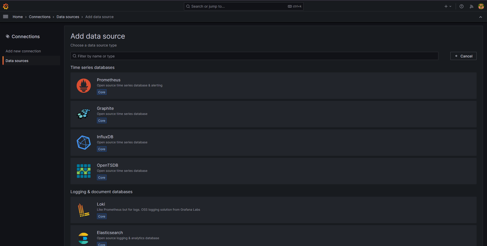

# Grafana-prometheus-docker
Repository Grafana Prometheus Running on Docker Container
list images:
- prom/prometheus
- prom/node-exporter
- grafana/grafana-oss
  

1. ketika pertama kali menjalankan akan mencoba pull images dari docker hub

2. Edit konfigurasi prometheus
edit source untuk menjalankan node-exporter pada bagian prometheus/prometheus.yml

```yml
- job_name: "node-exporter"

    # metrics_path defaults to '/metrics'
    # scheme defaults to 'http'.

    static_configs:
      - targets: ["ip-address-vm:9100"]
```

# How to running
```bash
docker-compose up
```

# How to access dashboard grafana
cara mengakses dashboard dari visualisasi grafana dengan browser
lalu akses dengan ip-address:3000





 


Buka https://grafana.com/grafana/dashboards/ untuk mencari dashboard templates

